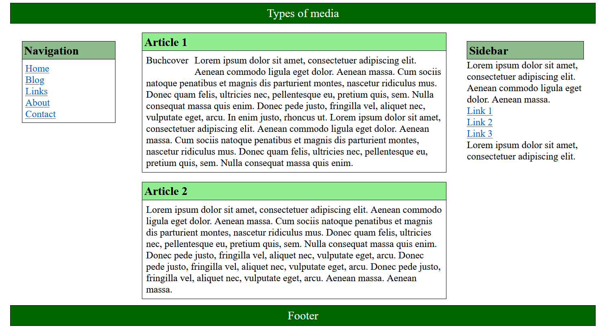
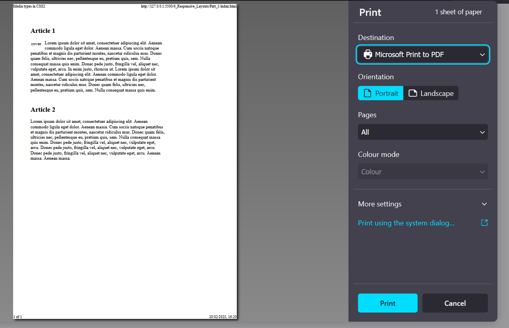
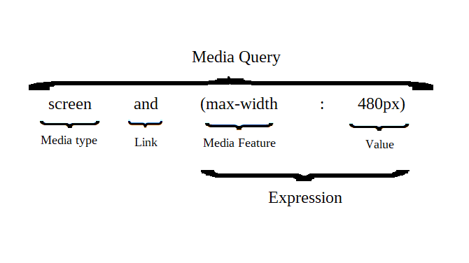

# CSS Guide Part 2

 Detailed guide about CSS (all basics for CSS) + templates.

 The code examples in the guide can be found in the listed folders.

-----------------------------------------------------------------------------------------

## Contents
### [CSS Guide Part 1]()
1. Introduction to CSS
    - 1.1. History of CSS 
    - 1.2. Principle of CSS application
    - 1.3. Embedding CSS into HTML
    - 1.4. Analyze CSS in the web browser
2. The CSS selectors
    - 2.1. The simple selectors of CSS
    - 2.2. Combinators
3. Inheritance and the cascade 
    - 3.1 The principle of inheritance in CSS
    - 3.2. Understanding the control system of the cascade
    - 3.3. Pass values to CSS properties
4. The box model of CSS 
    - 4.1. The classic box model
    - 4.2. The newer alternative box model of CSS
    - 4.3. Design boxes
    - 4.4. CSS Vendor Prefixes
5. CSS positioning
    - 5.1. Positioning with the CSS property `position`
    - 5.2. Stacking with `z-index`
    - 5.3. Floating boxes with `float`
    - 5.4. Flexible boxes (flexbox model)
### CSS Guide Part 2
6. Responsive layouts with CSS
    - 6.1. Theoretical basic knowledge about responsive web design


--------------------------------------------------------------------------------------------

# 6. Responsive layouts with CSS
Today, responsive layouts are used to display a suitable web page for the user for any device width.


## 6.1. Theoretical basic knowledge about responsive web design
The way the Internet is accessed today has become very versatile. Where a few years ago a website was only viewed with a desktop PC or laptop, today many other devices such as tablets, smartphones, e-book readers, game consoles or TVs have joined the mix. The challenge here is to respond to the screen size and screen resolution of each device with a suitable layout.

Statistics confirm the trend that mobile devices are now the most used devices when visitors are on the web.

The most common standard sizes:
- Smartphone: 320 to 480 pixels
- Tablets: 768 to 1024 pixels
- Desktop PCs: 1024 pixels and above

Instead of creating and maintaining countless layout versions for the same website, responsive web design is used. In this technique, the characteristics of the device are taken into account to adapt the website to achieve an optimal and custom display for the device. The main criterion for such a layout is the screen size of the device and the available input method, e.g. mouse or touch screen.


### The use of specific media types
Using the `link` element, CSS instructions are provided for the screen (`media="screen"`) and a special version for the printer (`media="print"`). If the media type is not defined, then the CSS instructions automatically apply to all output types (`media="all"`).

 example --> *6_Responsive_Layouts/Part_1*

`media="screen"`

 


`media="print"`

 


### The media queries for media features
- The media features can be included and used in various ways. The use of such a media query in HTML can be noted as follows:

   ```
    ...
    <head>
        <link href="styles/style.css" rel="stylesheet" />
        <link href="styles/mobile.css" rel="stylesheet" media="screen and (max-width: 480px)" />
    </head>
    ...
   ```

mobile.css is used only if the maximum screen width of 480 pixels is not exceeded. For devices with a higher resolution, only style.css is used.

- Including queries in the `<style>` tag is possible as follows:

   ```
    ...
    <style type="text/css" media="screen and (max-width: 480px)">
        /* CSS statement for screen up to max. 480 pixel */
    </style>
    ...
   ```

- Embedding directly into the stylesheet with `@media`:

   ```
    ...
    .main {
        background-color: blue;
    }

    @media screen and (max-width: 480px) {
        .main {
        background-color: yellow;
        }   
    }
    ...
   ```

If the maximum screen size of 480 pixels is not exceeded, the background is displayed in yellow.

- Use media features with the `@import` rule as follows:

   ```
    @import url('styles/mobile_480.css') screen and (max-width: 480px);
   ```

Thus, querying media features can be used in HTML with the `link` element or in the `style` element and in CSS with the `@media` or `@import` rule.


### Basic structure of a media features query

 


#### Link the media features
The media features is linked with the keyword `and`. Several `and` characteristics can be linked and processed. The link can be made with or without a media type.

For example:

   ```
    @media screen and (min-width: 960px) {
        /* CSS statement for desktop */
    }
   ```

   ```
    @media screen and (min-width: 768px) and (max-width: 960px) {
        /* CSS statement for tablets and netbooks */
    }
   ```

   ```
    @media screen and (max-width: 480px) {
        /* CSS statement for smartphones */
    }
   ```

If only one media type is to be used, a specification can be made in front of the media type with `only`.
   ```
    @media only screen and (max-width: 480px) {
        /* CSS statement for smartphones */
    }
   ```

A media query can also be negated with `not`.


### Which media features can be queried?
The various output devices have many different features. The most common feature that is queried is the minimum and maximum width of the display area.


| Media features | Meaning                                                          | Values |
| -------------- | ---------------------------------------------------------------- | ------ |
| `width`,`min-width`,`max-width` | Width of the display area (viewport) of the web browser. Possible values are positive length values e.g. `min-width: 480px`. | px, %, em |
| `height`,`min-height`,`max-height` | Height of the display width of the web browser. Possible values are positive length values e.g. `max-height: 720px`. | px, %, em |
| `orientation` | This sets the orientation of the device from. The orientation can be portrait or landscape e.g. `orientation: landscape`. | portrait, landscape |
| `aspect-ration`, `min-aspect-ration`, `max-aspect-ration` | Specifies the aspect ratio of `width` and `height` to each other. A value of 1280 x 720 corresponds to an aspect ratio of 16:9. | width/height e.g. 16/9, 1280/720 |
| `color`, `min-color/max-color` | Query the color depth of the device. For black and white devices the value for color is 0  | Integer value |
| `color-index`, `min-color-index`, `max-color-index` | Checks the use of indexed colors of the output device | Integer value |
| `monochrome`, `min-monochrome`, `max-monochrome` | Checks if the output device is monochrome. | Integer value |
| `resolution`, `min-resolution`, `max-resolution` | Query the pixel density of the device, e.g. `resolution: 720dpi`. | dpi, dcm |
| `pointer`, `any-pointer` | Tests if the output device provides a mouse as an input device. | none, coarse, fine |
| `hover`, `any-hover` | Checks if the output device provides hover effects at the primary input device. | none, hover |


An overview of all media features can be found at [WC3 - Media Queries](https://www.w3.org/TR/mediaqueries-4/).


### The viewport for mobile devices
