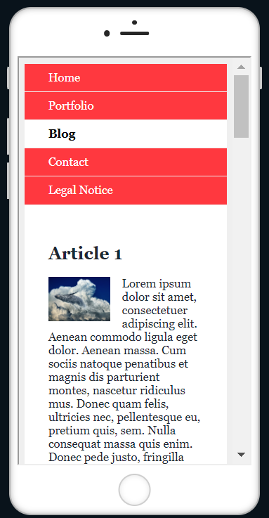
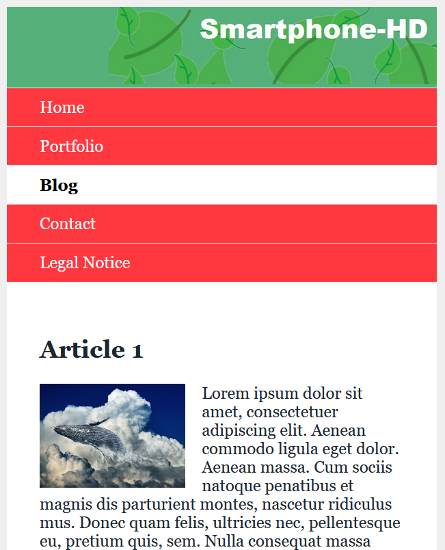
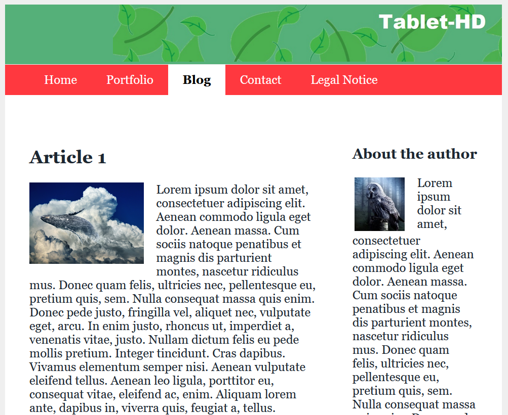
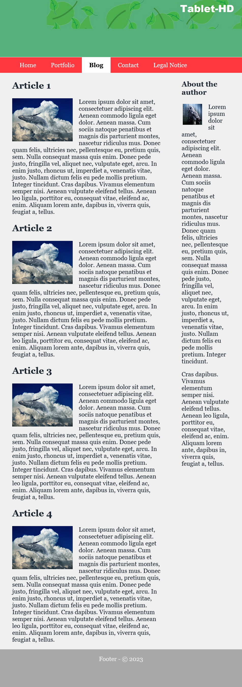
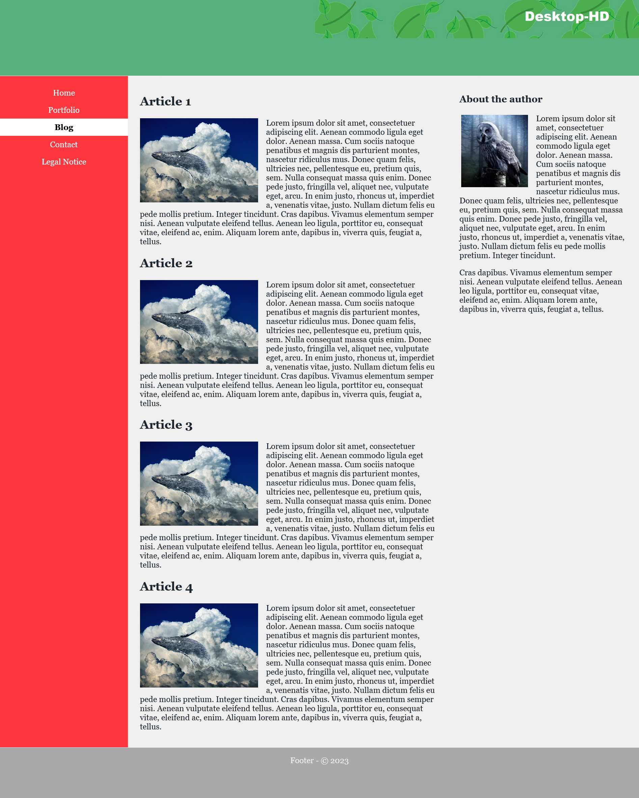

# CSS Guide Part 3

 Detailed guide about CSS (all basics for CSS).

 Part 3 contains : Responsive layouts with CSS (Grid-Layouts).

 The code examples in the guide can be found in the listed folders.

-----------------------------------------------------------------------------------------

## Contents
### [CSS Guide Part I]()
1. Introduction to CSS
    - 1.1. History of CSS 
    - 1.2. Principle of CSS application
    - 1.3. Embedding CSS into HTML
    - 1.4. Analyze CSS in the web browser
2. The CSS selectors
    - 2.1. The simple selectors of CSS
    - 2.2. Combinators
3. Inheritance and the cascade 
    - 3.1 The principle of inheritance in CSS
    - 3.2. Understanding the control system of the cascade
    - 3.3. Pass values to CSS properties
### [CSS Guide Part II]()
4. The box model of CSS 
    - 4.1. The classic box model
    - 4.2. The newer alternative box model of CSS
    - 4.3. Design boxes
    - 4.4. CSS Vendor Prefixes
5. CSS positioning
    - 5.1. Positioning with the CSS property `position`
    - 5.2. Stacking with `z-index`
    - 5.3. Floating boxes with `float`
    - 5.4. Flexible boxes (flexbox model)
### CSS Guide Part III
6. Responsive layouts with CSS
    - 6.1. Theoretical basic knowledge about responsive web design
    - 6.2. Create a responsive layout
    - 6.3. Responsive layouts with images
    - 6.4. The CSS Grid Layout
    - 6.5. Change the behavior of HTML elements with `display`
    - 6.6. Calculation with CSS and the `calc()` function
### [CSS Guide Part IV]()
7. Styling with CSS


--------------------------------------------------------------------------------------------

# 6. Responsive layouts with CSS
Today, responsive layouts are used to display a suitable web page for the user for any device width.


## 6.1. Theoretical basic knowledge about responsive web design
The way the Internet is accessed today has become very versatile. Where a few years ago a website was only viewed with a desktop PC or laptop, today many other devices such as tablets, smartphones, e-book readers, game consoles or TVs have joined the mix. The challenge here is to respond to the screen size and screen resolution of each device with a suitable layout.

Statistics confirm the trend that mobile devices are now the most used devices when visitors are on the web.

The most common standard sizes:
- Smartphone: 320 to 480 pixels
- Tablets: 768 to 1024 pixels
- Desktop PCs: 1024 pixels and above

Instead of creating and maintaining countless layout versions for the same website, responsive web design is used. In this technique, the characteristics of the device are taken into account to adapt the website to achieve an optimal and custom display for the device. The main criterion for such a layout is the screen size of the device and the available input method, e.g. mouse or touch screen.


### The use of specific media types
Using the `link` element, CSS instructions are provided for the screen (`media="screen"`) and a special version for the printer (`media="print"`). If the media type is not defined, then the CSS instructions automatically apply to all output types (`media="all"`).

 example --> *6_Responsive_Layouts/Part_1*

`media="screen"`

 


`media="print"`

 


### The media queries for media features
- The media features can be included and used in various ways. The use of such a media query in HTML can be noted as follows:

   ```
    ...
    <head>
        <link href="styles/style.css" rel="stylesheet" />
        <link href="styles/mobile.css" rel="stylesheet" media="screen and (max-width: 480px)" />
    </head>
    ...
   ```

mobile.css is used only if the maximum screen width of 480 pixels is not exceeded. For devices with a higher resolution, only style.css is used.

- Including queries in the `<style>` tag is possible as follows:

   ```
    ...
    <style type="text/css" media="screen and (max-width: 480px)">
        /* CSS statement for screen up to max. 480 pixel */
    </style>
    ...
   ```

- Embedding directly into the stylesheet with `@media`:

   ```
    ...
    .main {
        background-color: blue;
    }

    @media screen and (max-width: 480px) {
        .main {
        background-color: yellow;
        }   
    }
    ...
   ```

If the maximum screen size of 480 pixels is not exceeded, the background is displayed in yellow.

- Use media features with the `@import` rule as follows:

   ```
    @import url('styles/mobile_480.css') screen and (max-width: 480px);
   ```

Thus, querying media features can be used in HTML with the `link` element or in the `style` element and in CSS with the `@media` or `@import` rule.


### Basic structure of a media features query

 


#### Link the media features
The media features is linked with the keyword `and`. Several `and` characteristics can be linked and processed. The link can be made with or without a media type.

For example:

   ```
    @media screen and (min-width: 960px) {
        /* CSS statement for desktop */
    }
   ```

   ```
    @media screen and (min-width: 768px) and (max-width: 960px) {
        /* CSS statement for tablets and netbooks */
    }
   ```

   ```
    @media screen and (max-width: 480px) {
        /* CSS statement for smartphones */
    }
   ```

If only one media type is to be used, a specification can be made in front of the media type with `only`.
   ```
    @media only screen and (max-width: 480px) {
        /* CSS statement for smartphones */
    }
   ```

A media query can also be negated with `not`.


### Which media features can be queried?
The various output devices have many different features. The most common feature that is queried is the minimum and maximum width of the display area.


| Media features | Meaning                                                          | Values |
| -------------- | ---------------------------------------------------------------- | ------ |
| `width`,`min-width`,`max-width` | Width of the display area (viewport) of the web browser. Possible values are positive length values e.g. `min-width: 480px`. | px, %, em |
| `height`,`min-height`,`max-height` | Height of the display width of the web browser. Possible values are positive length values e.g. `max-height: 720px`. | px, %, em |
| `orientation` | This sets the orientation of the device from. The orientation can be portrait or landscape e.g. `orientation: landscape`. | portrait, landscape |
| `aspect-ration`, `min-aspect-ration`, `max-aspect-ration` | Specifies the aspect ratio of `width` and `height` to each other. A value of 1280 x 720 corresponds to an aspect ratio of 16:9. | width/height e.g. 16/9, 1280/720 |
| `color`, `min-color/max-color` | Query the color depth of the device. For black and white devices the value for color is 0  | Integer value |
| `color-index`, `min-color-index`, `max-color-index` | Checks the use of indexed colors of the output device | Integer value |
| `monochrome`, `min-monochrome`, `max-monochrome` | Checks if the output device is monochrome. | Integer value |
| `resolution`, `min-resolution`, `max-resolution` | Query the pixel density of the device, e.g. `resolution: 720dpi`. | dpi, dcm |
| `pointer`, `any-pointer` | Tests if the output device provides a mouse as an input device. | none, coarse, fine |
| `hover`, `any-hover` | Checks if the output device provides hover effects at the primary input device. | none, hover |


An overview of all media features can be found at [WC3 - Media Queries](https://www.w3.org/TR/mediaqueries-4/).


### The viewport for mobile devices
The viewport plays an essential role in terms of querying media features on mobile devices. The viewport on desktop computers and the viewport on mobile devices often causes a bit of confusion. High-resolution displays make it even more complicated, as a pixel is suddenly no longer a pixel. A collection of the many different sizes of displays on different devices can be found at [Screensiz.es](http://screensiz.es/).

In terms of desktop computers, the viewport is the inner area of the browser window without the borders. When the browser window is reduced or enlarged, the viewport is also reduced or enlarged. This visual viewport can be addressed with the media features `width` and `height`. On mobile devices like a smartphone, the screens are much smaller than on a desktop computer, but the viewport there is still often larger than on desktop screens. Without special adjustments to the viewport for mobile devices, therefore, the web page on these devices would often be called a layout viewport.

The problem with mobile devices can be easily solved with the meta-tag `viewport` or CSS rule `@viewport`. 

- The metatag `viewport` is added in the `head` area of the HTML document

   ```
    <meta name="viewport" content="width=device-width, initial-scale=1.0">
   ```

The `width=device-width` sets the width of the layout viewport to the width of the visual viewport. With this line all different layout viewports from different devices are normalized and adjusted to the current display size. Besides `width` there is the counterpart with `height=device-height` for the height, but this is rarely needed in practice.

With `initial-scale=1.0` the initial zoom value is set to 100% or 1:1. In addition to `initial-scale` there are further viewport features with `minimum-scale` or `maximum-scale`, with which the minimum and maximum zoom level can be set. With `user-scaleable=no` zooming can be blocked completely.

- The `@viewport` rule

   ```
    @viewport {
        width: device-width;
        zoom: 1;
    }
   ```

In the future the CSS rule `@viewport` will probably replace the metatag. But not all browsers support this method yet. The advantage of the CSS rule is, that theoretically more is possible, because different media queries can be declared with different information.

Once the viewport has been adjusted, the web page must also be optimized using media queries. The setting of the viewport alone only ensures that the automatic scaling of the web browser has been switched off.


### Use `em` instead of `px` for a layout wrap (breakpoints)
Performing the media query with the unit `em` is quite helpful, since the screen is measured in pixels. The advantage is that the media query then works correctly even if the font size is changed. This ensures that when the fonts are displayed larger, the next layout level is really triggered and the layout does not collapse.

   ```
    @media screen and (min-width: 640px) {
        /* CSS statement for for screens from 640px width */
    }
   ```

A breakpoint has been set up here for screens 640 pixels and larger. All CSS statements between the curly brackets are thus only executed from a screen width of 640 pixels. Referring to the recommendation to use the unit `em` for such breakpoints, the screen size only has to be divided by 16. 16 pixels is usually the browser base font size. 640 pixels divided by `16px` is `40em`. 

This means then:

   ```
    /* 640px / 16px = 40em */
    @media screen and (min-width: 40em) {
        /* CSS statement for for screens from 640px width */
    }
   ```


### Breakpoints
The layout is changed during these wraps. In practice, different layouts for different resolutions are provided here, which can be controlled with media queries.

   ```
    /* CSS statement for for screens from 640px width */

    /* 640px / 16px = 40em */
    @media screen and (min-width: 40em) {
        /* CSS statement for for screens from 640px width */
    }

    /* 1024px / 16px = 64em */
    @media screen and (min-width: 64em) {
        /* CSS statement for for screens from 1024px width */
    }

    /* 1280px / 16px = 80em */
    @media screen and (min-width: 80em) {
        /* CSS statement for for screens from 1280px width */
    }
   ```

Here three common breakpoints have been defined with media queries. The statements are definitely executed before the first breakpoint. Here, in addition to the basic CSS properties, the mobile layout for smartphones can also be defined right away. Subsequently is still for the screen widths 640 pixels (tablets), 1024 pixels (desktop) and 1280 pixels (extra large desktop).


### `box-sizing: border-box;`
By using the box model with `border-box`, you do not need to calculate with `width`, `padding` and `border`. This CSS statement should be set right at the beginning.

   ```
    html {
        box-sizing: border-box;
    }

    *, *::before, *::after {
        box-sizing: inherit;
    }
   ```

#### Media queries are now understood by all major web browsers. Browsers that cannot handle media queries, the browser uses the base version of the website that was defined before the first breakpoint with a media query. Therefore, it is always recommended to create a base version before the media queries. 


## 6.2. Create a responsive layout
Whether a website is first created as a desktop version or as a mobile version, everyone should decide for themselves and also depends on how the page is used. But today it is recommended to start with the mobile version first, because most users consider the mobile version first.

Here is the mobile version first:

 example --> *6_Responsive_Layouts/Part_2/index.html*
   ```
    <!DOCTYPE html>
    <html lang="en">

    <head>
        <meta charset="utf-8">
        <title>mobile version</title>
        <meta name="viewport" content="width=device-width, initial-scale=1">
        <link rel="stylesheet" href="styles/layout.css">
    </head>

    <body>
        <div class="wrapper">
            <header class="header">
                Responsive web design - Logo
            </header>
            <nav>
                <ul class="nav-ul">
                    <li class="nav-li"><a href="#" title="dummy" class="nav-li-a">Home</a></li>
                    <li class="nav-li"><a href="#" title="dummy" class="nav-li-a">Portfolio</a></li>
                    <li class="nav-li nav-active"><strong class="nav-li-a">Blog</strong></li>
                    <li class="nav-li"><a href="#" title="dummy" class="nav-li-a">Contact</a></li>
                    <li class="nav-li"><a href="#" title="dummy" class="nav-li-a">Legal Notice</a></li>
                </ul>
            </nav>
            <div class="container">
                <main class="content">
                    <article class="article">
                        <h2>Article 1</h2>
                        <p>Lorem ipsum ... </p>
                    </article>
                    <article class="article">
                        <h2>Article 2</h2>
                        <p>Phasellus viverra ...</p>
                    </article>
                    <article class="article clear">
                        <h2>Article 3</h2>
                        <p>Donec pede ...</p>
                    </article>
                    <article class="article">
                        <h2>Article 4</h2>
                        <p>Lorem ipsum ...</p>
                    </article>
                </main>
                <aside class="aside">
                    <h3>About the author</h3>
                    <p>Lorem ipsum ... </p>
                    <p>Cras dapibus... </p>
                </aside>
            </div>
            <footer class="footer">
                Footer - &copy;&nbsp;2023
            </footer>
        </div>
    </body>

</html>
   ```

 example --> *6_Responsive_Layouts/Part_2/styles/layout.css*
   ```
    @charset "UTF-8";
    /* --------------------------------------------------
            General basic settings                             
     ----------------------------------------------------*/
    html {
        box-sizing: border-box;
    }

    *, *::before, *::after {
        box-sizing: inherit; 
    }

    body {
        color: #1d2731;
        background-color: #efefef; 
        font-family: Georgia; 
    }

    ul {
        padding: 0;
    }

    .wrapper {
        background-color: #ff383f; 
    }

    /* ------------------------------------------------------------------
        CSS properties for mobile devices (smaller than 640 px)            
        + Arrange everything in one column below each other                                              
    -------------------------------------------------------------------- */
    .header {
        text-align: center;
        padding: 1em ;
        background-color: #55b079; 
        color: #efefef;  
        border-bottom: 1px solid #efefef;
    }

    .aside {
        border-top: 1px solid #a9a9a9;
        padding-top: 0.5em;
    }

    .footer {
        background-color: #a9a9a9; 
        color: #efefef;
        padding: 1em;
        text-align: center; 
        border-top: 1px solid #efefef;
    }

    .nav-ul {
        background-color: #ff383f;
        margin:0;
    }

    .nav-li {
        list-style: none;
        margin-left: 0;
        border-bottom: 1px solid #efefef;
    }

    .nav-li-a  {
        padding: 0.6em 2rem;
        display: block; 
    }

    .nav-ul a:link {
        text-decoration: none; 
    }

    .nav-ul a:link, .nav-ul a:visited {
        color: #fff; 
    }

    .nav-ul a:hover, .nav-ul a:focus, .nav-ul a:active {
        background-color: #000; 
        color: #efefef; 
    }

    .nav-active {
        color: #000; 
        background-color: #fff; 
    }

    .container {
        background-color: #fff; 
        padding: 2em 2rem;
    }
   ```
 

 

Here is the mobile version + desktop version:

 example --> *6_Responsive_Layouts/Part_3/styles/layout.css*
   ```
    @charset "UTF-8";
    /* --------------------------------------------------
            General basic settings                              
    ----------------------------------------------------*/

    ...

    /* ------------------------------------------------------------------
          CSS properties for mobile devices (smaller than 640 px)            
            + Arrange everything in one column below each other                                             
    -------------------------------------------------------------------- */

    ...

    /*-----------------------------------------------------   
        Tablet version from 640 pixel                          
        640px / 16px/em = 40em  
            + 2 columns
            - Header and navigation on top below each other
		    - Main content and sidebar next to each other
		    - Footer bar below
    ------------------------------------------------------*/
    @media screen and (min-width: 40em) {
        .header {
            padding: 1.5em;
            text-align: left; 
        }

        .container {
            padding: 3rem 0;
            display: block;
            overflow: auto; 
        }

        .content {
            display: block;
            float: left;
            width: 65%;
            padding: 0 1rem 0 2rem; 
        }

        .aside {
            display: block;
            margin: 0 0 0 65%;
            width: 35%;
            padding: 0 2rem 0 2rem;
            border-top: none; 
        }

        .nav-ul {
            padding: 0 2rem;
            overflow: hidden;	
        }

        .nav-li {
            float: left;
            display: inline-block;
            border: none;
            width: auto; 
        }
   
        .nav-li-a{
            padding: 0.7em 1.2rem;
            display: inline-block;
        }
    }    

   ```
Desktop version:

 

Smartphone version:

 

Here you can see that the view automatically adapts to the screen, i.e. smartphone or desktop.

More examples: 

 example --> *6_Responsive_Layouts/Part_4/styles/layout.css*

Desktop version:

 

Smartphone version:

 

Extra Large Desktop Version:

 


 example --> *6_Responsive_Layouts/Part_4/styles/layout.css*

The examples created in this way now flexibly adapt to the layout breaks with the media queries to the user's devices.


### Relative font sizes
Relative specifications should always be used instead of pixels for font sizes. On screens with a higher pixel density, fonts that are specified with pixels are displayed relatively small. It is possible to zoom in on them later, but a website should be rendered legibly immediately after loading. Therefore, pixels should be avoided and relative specifications such as em, rem or percent should be used.


## 6.3. Responsive layouts with images
With a fixed image size, the text can slip away towards the bottom, and individual words can be left at the top if there is not enough space. This text wrapping can be avoided by setting the maximum width of the image with the CSS property `max-width` accordingly in percent. With `max-width` the maximum width of an element can be determined.

 example --> *6_Responsive_Layouts/Part_6/styles/layout.css*
   ```
    ...
    .img-art {
        float: left;
        margin: 0 1em 0.2em 0;
        max-width: 40%;
        height: auto;
    }

    .img-side {
        float: left;
        margin: 0.1em 1em 0.2em 0.2em;
        max-width: 40%;
        height: auto;
    }
    ...

   ```
 

 


### Flexible images in maximum possible width
If images should always be expanded over the full width regardless of the device and still remain responsive, `max-width` can be set to 100%. This also depends on where the image is placed. Setting an image to 100% means that an image will not be responsive until the column it is defined in is smaller than the image. It also depends on the context in which the image is used.

 example --> *6_Responsive_Layouts/Part_6/index.html*
   ```
    ...
    <header class="header">
        
    </header>
    ...

   ```

 example --> *6_Responsive_Layouts/Part_6/styles/layout.css*
   ```
    ...
    .img-logo {
        max-width: 100%;
        height: auto;
    }
    ...

   ```

With `<video>` it works the same way as with images.


### Hide images
To hide images in a certain version, here for example for smartphones you can set `display` to `none`. On the desktop screen, the logo remains visible.
For the other layout wraps you have to make the header visible again with `display: block`.

 example --> *6_Responsive_Layouts/Part_7/styles/layout.css*
   ```
    ...
    .img-logo {
        display: none;
    }

    ...

    /*-----------------------------------------------------   
        Tablet version from 640 pixel                          
    ------------------------------------------------------*/

    .img-logo {
        display: block;
        max-width: 100%;
        height: auto;
    }
    ...
   ```

 


### Load pictures matching the screen width with `<picture>`
The disadvantage of `max-width` is that with small displays often large files must be loaded, this is bad for the Performence and the pictures must be scaled down, which affects the picture quality negatively. 
The `<picture>` element, serves as a container element for multiple image sources. The individual image sources are specified with `source`.


 example --> *6_Responsive_Layouts/Part_8/index.html*
   ```
    ...

    <header class="header">
        <picture class="img-logo">
            <source media="(min-width: 1023px)" srcset="images/logo-desktop.jpg 1x,images/logo-desktop-HD.jpg 2x">
            <source media="(min-width: 639px)" srcset="images/logo-tablet.jpg 1x,images/logo-tablet-HD.jpg 2x">
            <source srcset="images/logo-smartphone.jpg 1x,images/logo-smartphone-HD.jpg 2x">
            <!-- Fallback for browsers that can't do <picture> -->
            
        </picture>
    </header>

    ...
   ```

 

 


### Use area covering images
When a background image is inserted with `background-image`, the height and width can be adjusted with the CSS property `background.size`.

 example --> *6_Responsive_Layouts/Part_9/styles/layout.css*
   ```
    ...

    .img-background {
        background-size: cover;
        background-image: url("../images/background.jpg");
        background-repeat: no-repeat;
    }

    ...
   ```


## 6.4. The CSS Grid Layout
In the previous examples, it is quite time-consuming to realize a more complex layout or to redesign it. For such purposes the grid layout is a good choice. CSS offers real design grids with CSS grid layouts.


### Creating a grid for content
The principle of a CSS grid is based on creating a grid in a parent element and positioning the child elements within it. To do this, assign the value `grid` to the CSS property `display` in the parent element and then use the properties `grid-template-columns` and `grid-template-rows` to define the individual grid lines.

   ```
    grid {
        display: grid;
        grid-template-rows: 150px auto auto 100px;
        grid-template-columns: 20% 20% 20% 20% 20%;
    }
   ```

This creates a CSS grid with four rows and five columns. The first row is 150 pixels high and the last 100 pixels high. The middle two rows are still adjusted with `auto` according to the content. All five columns are 20% wide. Besides the units percent or pixel, you can also use `em` or `fr`(e.g. 1fr or 2fr). The unit `fr` means *flexible fragment* (fractional part). 

 


The grid can be adjusted as desired.

   ```
    grid {
        display: grid;
        grid-template-rows: 150px auto auto auto 100px;
        grid-template-columns: repeat (10, 10%);
    }
   ```

This defines a grid layout with five rows and ten columns. The header area is specified with a height of 150 pixels and the footer area with 100 pixels. The three rows in between automatically adjust to the content. `repeat (10, 10%)` means `10% 10% 10% 10% 10% 10% 10% 10% 10% 10%`.

 

To use the grid layout, the class selector `.grid` must be used in the parent element, whose child elements are positioned in this grid. Inside the `div` parent element the child elements are placed (`<header>`, `<nav>`, `<main>`, `<aside>`, `<footer>`).

 example --> *6_Responsive_Layouts/Part_10/index.html*

   ```
    <body>
        <div class="grid">
            <header class="header">
                ...
            </header>
            <nav class="nav">
                ...
            </nav>
            <main class="content">
                ...
            </main>
            <aside class="aside">
                ...
            </aside>
            <footer class="footer">
                ...
            </footer>
        </div>
    </body>
   ```


 


### Place elements in the grid
With `grid-row-start` and `grid-row-end` or `grid-column-start` and `grid-column-end` you can specify where the HTML elements should be placed in the grid.

 example --> *6_Responsive_Layouts/Part_10/styles/layout.css*

   ```
    .header {
        grid-column-start: 1;
        grid-column-end: 11;
        grid-row-start: 1;
        grid-row-end: 2;
        text-align: right;
        background-color: #55b079;
        color: #efefef;
        border-bottom: 1px solid #efefef;
    }
   ```

 


   ```
    .nav {
        grid-column-start: 1;
        grid-column-end: 11;
        grid-row-start: 2;
        grid-row-end: 3;
    }

    .content {
        grid-column-start: 1;
        grid-column-end: 11;
        grid-row-start: 3;
        grid-row-end: 4;
    }

    .aside {
        grid-column-start: 1;
        grid-column-end: 11;
        grid-row-start: 4;
        grid-row-end: 5;
    }

    .footer {
        grid-column-start: 1;
        grid-column-end: 11;
        grid-row-start: 5;
        grid-row-end: 6;
    }
   ```

 


#### Shorthand

   ```
    .aside {
        grid-column: 1 / 11;
        grid-row: 4 / 5;
    }

   ```

means

   ```
    .aside {
        grid-column-start: 1;
        grid-column-end: 11;
        grid-row-start: 4;
        grid-row-end: 5;
    }

   ```

There is another shorter variant, with the `grid-area` property, the order is as follows:

`grid-area: row-start / column-start / row-end / column-end;`

   ```
    .aside {
        grid-area: 4 / 1 / 5 / 11;
    }

   ```

#### Place elements in next layout wrap
Starting from the basic mobile layout version, little work is now needed to respond to the next layout change for the tablet version.

 

 example --> *6_Responsive_Layouts/Part_10/styles/layout.css*

   ```
    @media screen and (min-width: 40em) {
        .content {
            grid-column: 1 / 8;
            grid-row: 3 / 4;
            padding: 0 1rem 0 2rem;
        }
        .aside {
            grid-column: 8 / 11;
            grid-row: 3 / 4;
            padding: 0 2rem 0 2rem;
            border-top: none;
        }
        ...
    }
   ```

Tablet-Version

 


And yet another version for the desktop:

 

 example --> *6_Responsive_Layouts/Part_10/styles/layout.css*

   ```
    @media screen and (min-width: 64em) {
        .content {
            grid-column: 3 / 8;
            grid-row: 2 / 4;
            padding: 1em 1.5em;
        }
        .aside {
            grid-column: 8 / 11;
            grid-row: 2 / 4;
            padding: 1em 1.5em;
        }
        .nav {
            grid-column: 1 / 3;
            grid-row: 2 / 4;
            background-color: #ff383f;
        }
        ...
    }
   ```

Desktop-Version

 


### Layout modification
Because the elements in the grid are freely positionable, it is easy to redesign the layout now. For this, only the positions of the cells and columns in the grid have to be adjusted.
To change the desktop version from the previous example, you can simply change the values for `grid-column` as follows:

 example --> *6_Responsive_Layouts/Part_11/styles/layout.css*

   ```
    @media screen and (min-width: 64em) {
        .content {
            grid-column: 4 / 9;
            grid-row: 2 / 4;
            padding: 1em 1.5em;
        }
        .aside {
            grid-column: 1 / 4;
            grid-row: 2 / 4;
            padding: 1em 1.5em;
        }
        .nav {
            grid-column: 9 / 11;
            grid-row: 2 / 4;
            background-color: #ff383f;
        }
        ...
    }
   ```

Desktop-Version

 

So the navigation is now on the right side.


### The spacing between grid lines
If spacing between columns or rows should be added, this can be done with `grid-column-gap` or `grid-row-gap`. The spaces are only created between the columns. No spacing is added at the beginning and end of the column.

for example:

   ```
    grid {
        display: grid;
        grid-template-rows: 150px auto auto auto 100px;
        grid-template-columns: repeat (10, 10%);
        grid-row-gap: 15px;
        grid-column-gap: 10px;
    }
   ```

the shorthand is:
    `grid-gap: 15px 10px;`


#### Align elements in CSS grid
Also the horizontal and vertical alignment of the parent elements can be set with the CSS property `align-items` for vertical and with `justify-items` for horizontal behavior. The values `start`, `end`, `stretch` and `center` are available. 
For an individual alignment of a single raster cell, `align-self` and `justify-self` are available. Here, too, the values `start`, `end`, `stretch` and `center` are available.


## 6.5. Change the behavior of HTML elements with `display`
The CSS property `display` can be used to change the behavior of an HTML element when it is displayed in the web browser. The HTML element has a fixed box that describes the behavior of the element. 
Thus, the behavior of an HTML element such as `<p>` can be changed with `display: inline;` and thus no more line breaks are executed.
On the other hand, the behavior of an element like `<a>` can be changed with `display: block` so that it performs a line break. With `display: none;` an element can be hidden so that it no longer takes up space in the HTML document.


### `block`, `inline` and `inline-block`

- `display: block;`

 example --> *6_Responsive_Layouts/Part_12/indexA.html*

   ```
    p { 
      display: block;
      width: 150px;
      border: 1px solid black;
      background-color: white;
      padding: 1em;
    }
   ```

In this example, `display: block;` can also be omitted, since the `<p>` element is a block element anyway, so a line break is automatically created.

 


- `display: inline;`

But if now `display: inline;` is used, the single `<p>` -elements are displayed in a row, so no automatic line break.

 example --> *6_Responsive_Layouts/Part_12/indexB.html*

   ```
    p { 
        display: inline;
        width: 150px;
        border: 1px solid black;
        background-color: white;
        padding: 1em;
    }
   ```

 

The specification of `width` is ignored and thus has no effect. Although the inner and outer margins and borders can be specified as usual, these specifications also have no effect on the line height. Thus, an `inline` box only occupies the width that the content requires. And may not look very nice, as in this example.


- `display: inline-block;`

 example --> *6_Responsive_Layouts/Part_12/indexC.html*

   ```
     p { 
      display: inline-block;
      width: 150px;
      border: 1px solid black;
      background-color: white;
      padding: 1em;
    }
   ```

 

 

An `inline-block` -box initially behaves like an `inline` -box and runs over one line. But an `inline-block` -box is moved to the next cell when the box no longer fits in the screen width.


- `display: none;`

 example --> *6_Responsive_Layouts/Part_12/indexD.html*

   ```
     p { 
      display: none;
      width: 150px;
      border: 1px solid black;
      background-color: white;
      padding: 1em;
    }
   ```


With `display: none;` elements can be hidden, the web browser does not create a box for this. It is also possible to hide elements with `visibility: hidden;`, but the box remains, and the element becomes only transparent. Hidden or transparent elements are used, for example, to show buttons only in the smartphone version but not in the desktop version.


#### Further values for `display`
Besides `display: grid` and `display: flex` (which I have already discussed here), another form is `display: table;`. With this, elements can be arranged like in a table and in practice, theoretically, a layout for a web page can be created. But for that `display: grid` is the better alternative. 
Then there is also `display: list-item;`, which displays the element as a list. This creates two boxes for an element. One box is used for the list item and the other box for the list element.
There are other values for `display`, but they are rarely used. An overview of the existing values can be found at [MDN - display](https://developer.mozilla.org/en-US/docs/Web/CSS/display).

 example --> *6_Responsive_Layouts/Part_12/indexE.html*

   ```
    .table {
        display: table;
    }

    .row {
        display: table-row;
    }

    .article {
        border: 1px solid black;
        padding: 1em;
        width: 33.3333%;
        background-color: LightSeaGreen;
        display: table-cell;
    }

    .bottom {
        vertical-align: bottom;
    }

    .middle {
        vertical-align: middle;
    }
   ```

 


## 6.6. Calculation with CSS and the `calc()` function
Sometimes it is helpful to calculate and display individual values. This is possible with the `calc()` function, with which the basic arithmetic operations addition(+), subtraction(-), multiplication(*) and division(/) can be carried out. It is important that with the addition and subtraction, before and after a blank character must stand. This is not necessary for multiplication and division.

 example --> *6_Responsive_Layouts/Part_13/styles/layout.css*

   ```
    .column {
        float: left;
        padding: 10px;
        width: 90%;
        width: calc(100% / 4);
    }

    @media screen and (max-width: 40em) {
        .column {
            width: calc(100% / 2);
        }
    }

    @media screen and (max-width: 30em) {
        .column {
            width: 100%;
        }
    }
   ```

Desktop-Version

 

Tablet-Version

 


-----------------------------------------------------------------------------------------------------------------

This is the end of CSS Guide Part 3. You can find the next part here [CSS Guide Part IV]().

On my Twitter account [@bella_mrx](https://twitter.com/bella_mrx) you can find more useful stuff about HTML and web development. 

Or check out my [GitHub](https://github.com/BellaMrx) profile.


Thanks for reading. 
I hope you enjoyed it or at least learned something.


